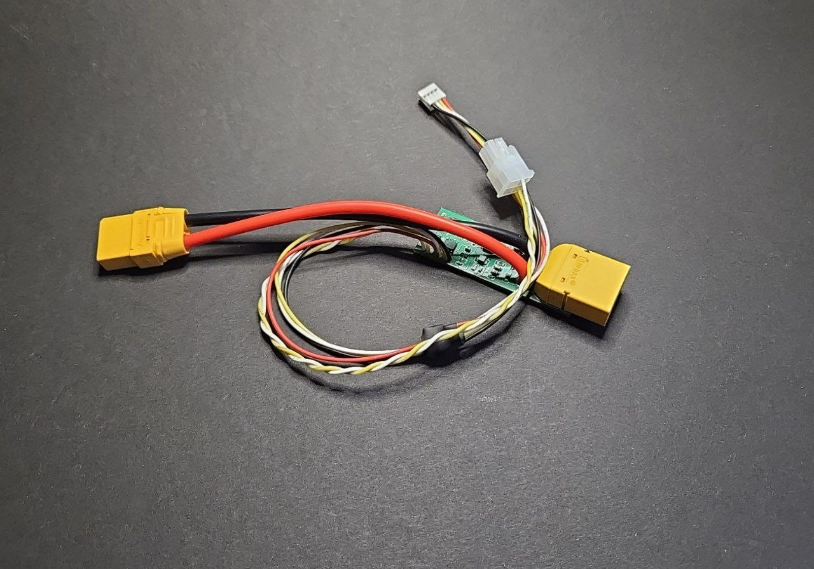

## Description:

Integrator - device that allows you to connect JBD BMS to the controller of Ninebot G3 \ ZT3 \ F3 \ GT3 \ GT3 \ GT3 Pro series scooters. 
Key Features :
1. Full Plug & play, no need to flash the controller or bms
2. Supported apps:  Segway mobility, Powernine, Xiaodash
3. Full projection of battery information: current, temperature, cells voltage, battery voltage.
4. Extreme use timers.
5. Sleep mode to minimize power consumption
6. Battery connection up to 18s (need MCU modding, more info below)
7. Charging mode display function

⚠️ WARNING: To increase the voltage, you must replace the resistor inside the MCU that matches your voltage from the list below. Acceptable range is +5% 

| Конфигурация | Сопротивление |
| ------------ | ------------- |
| 13s          | 200khom       |
| 14s          | 215khom       |
| 15s          | 230khom       |
| 16s          | 246khom       |
| 17s          | 260khom       |
| 18s          | 276khom       |

## Installation:

1) ⚠️ Disable charge\discharge fets in app ⚠️

2) Conect Integrator to BMS with small 4 pin connector to uart port
3) Connect Integrator to MCU with 4pin Molex minifit connector
4) Connect Integrator with xt90 to MCU
5) Connect battery with xt90 to integrator
6) Enable charge\discharge fets in app

## Best practices:

1) If you are using an electric brake, it is recommended that you set the overvoltage and overcurrent limits in the BMS settings to the maximum possible for your BMS. During braking, current flows into the battery and the voltage/current can be higher than the rated values, especially if the battery is 100% charged. If this is not done, the BMS may go into protection and the current will have nowhere to go but to stay somewhere in the controller(MCU), causing damage to the controller. It is also recommended not to charge the battery to 100%, thus prolonging the life of the battery itself and leaving free space for excess current during braking. This is the same as if you were trying to fill a bottle with more water than its capacity.