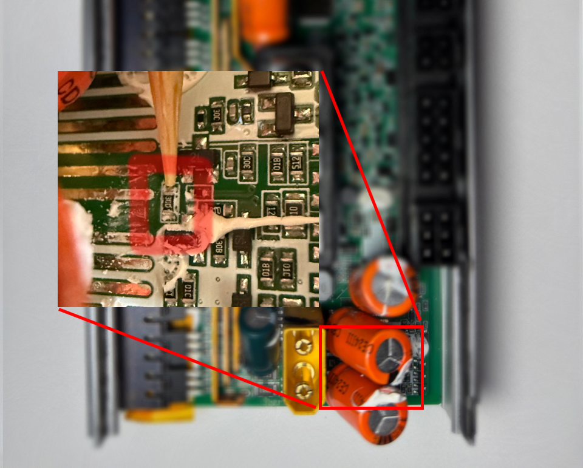

## Описание:

Интегратор - устройство позволяющее подключить JBD BMS к  контроллеру самокатов Ninebot серии G3 \ ZT3 \ F3 \ GT3 \ GT3 Pro. 
Ключевые особенности :
1. Полный Plug & play, нет необходимости прошивки контроллера или бмс
2. Поддерживаемые приложения Segway mobility, Powernine, Xiaodash
3. Полная проекция информации о батарее : ток, температура, напряжения, втч побаночные
4. Таймеры экстремального использования.
5. Режим сна для минимизации энергопотребления
6. Подключение аккумуляторов до 18s (необходима модификация MCU, подробности ниже)
7. Функция отображения режима зарядки
8. Синхронизация времени устройства с дашбордом (VCU)

⚠️ WARNING: Для повышения напряжения, необходимо заменить резистор внутри MCU соответствующий вашему напряжению из списка ниже. Допустимо устанавливать номинал +5%

| Конфигурация | Сопротивление |
| ------------ | ------------- |
| 13s          | 200k          |
| 14s          | 215k          |
| 15s          | 230k          |
| 16s          | 246k          |
| 17s          | 260k          |
| 18s          | 276k          |

## Установка:
 
1) ⚠️ Отключите мосфеты заряда/разряда в приложении. ⚠️
![[jbd_app_fets.jpg]]
2) Подключите интегратор к BMS с помощью небольшого 4-контактного разъёма к порту UART.
3) Подключите интегратор к MCUс помощью 4-контактного разъёма Molex minifit.
4) Подключите интегратор с помощью разъёма XT90 к MCU.
5) Подключите аккумулятор с помощью разъёма XT90 к интегратору.
6) Включите мосфеты заряда/разряда в приложении.

![[install_tutorial.jpg]]